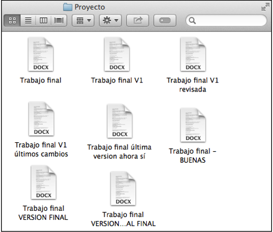
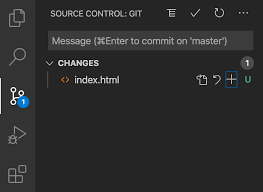
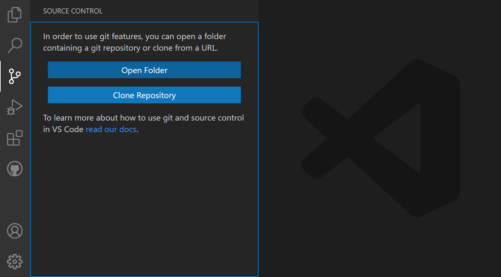
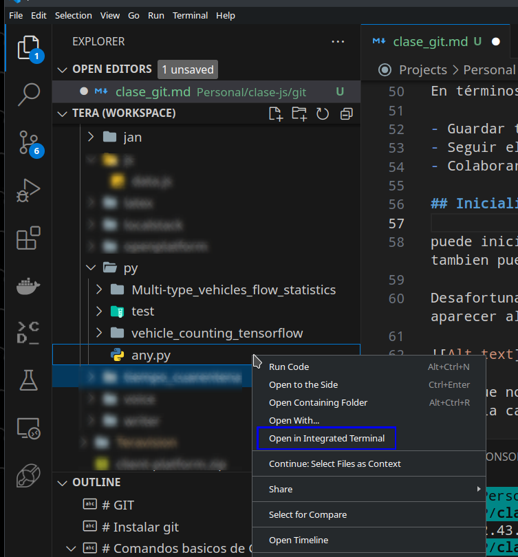
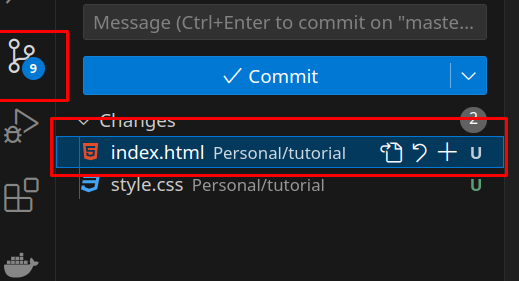
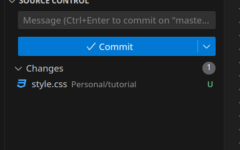
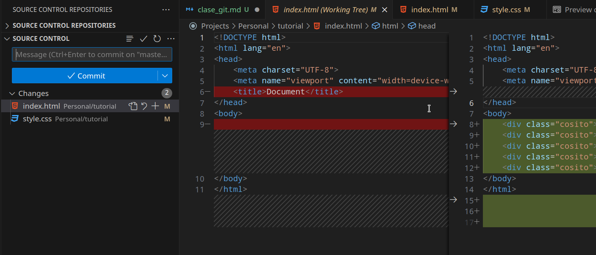
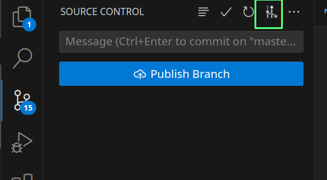
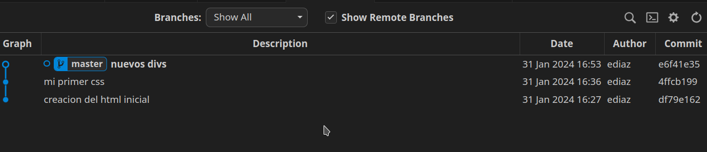

# GIT

Muchas veces en el pasado puede que nos tocara tener una version modificada de algo. un ejemplo es un proyecto final de universidad en el cual puede ocurrir lo siguiente:



Afortunadamente Word y google Docs tiene un sistema con el cual se puede ver que cambio hubieron recientemente, quien y cuando se hicieron.

Al momento de desarrollar uno se puede encontrar en una situacion similar. y aqui es donde viene a usarse GIT


Git es un sistema de control de versiones que nos permite poder gestionar todas las versiones de nuestro codigo por medio de comandos. Actualmente VSCODE viene con herramientas que hacen mas amigable el uso de git pero se debe de tener en cuenta que hay ocasiones donde se va a requerir el uso de la terminal.



# Instalar git

git no es complicado de instalar para ello se puede seguir la [guia de git](https://git-scm.com/downloads)

puedes confirmar si ya tienes git instalado ejecutando en una terminal `git -v`

# Comandos basicos de GIT

ya con git puedes comenzar a usarlo

## Configurar tu identidad en git

Asi como en word y google docs cuando compartes un archivo y alguien realiza modificaciones estas plataformas no dicen quien y cuando realizo los cambios. En git es similar y para ello necesitas decirle a git a nombre de quien van a estar todos los cambios que realices.

Para ello tienes que ejecutar

```bash
# git config --global user.name [Nombre]
git config --global user.name Edwar
# git config --global user.email [email]
git config --global user.email edwar@gmail.com
```

con esto git ya sabe que los cambios que hagas van a estar vinculados a ese nombre y ese email. al usar `--global` esto se aplicara para todos los repositorios que tengas

## que es un repositorio?

Un repositorio en Git es un lugar donde puedes almacenar tu código y archivos. Es como un armario donde guardas las cosas que estás trabajando.

Cuando creas un repositorio, Git crea un historial de todas las versiones de tu código. Esto significa que puedes volver atrás en el tiempo y ver cómo era tu código en cualquier momento.

Los repositorios también pueden ser compartidos con otros. Esto te permite colaborar con otros desarrolladores en un proyecto.

En términos sencillos, un repositorio en Git es una caja de herramientas que te permite:

- Guardar tu código y archivos de forma segura
- Seguir el historial de cambios de tu código
- Colaborar con otros desarrolladores

## Inicializar el repositiorio

puede iniciar creando tu repositorio con github y luego seguir los pasos que alli te indican o tambien puedes seguir lo siguiente.

Desafortunandamente para este primer paso VS no siempre muestra la opcion segun encontre puede aparecer algo asi:

 

Dado que no siempre aparecera vamos a abrir la terminal es la ubicacion de nuestro codigo, es decir la carpeta que contiene todo el codigo



luego en la terminal escribira 

```bash
git init
```

en este momento se ha activado git en tu proyecto y se ha creado esl repositiorio y git comenzara a vizualizar los cambios realizado.

al haber inicializado el repositorio es muy probable que en vscode vea una nueva carpeta que se le ha creado, si no la ve no hay lio generalmente es una carpeta oculta:


en esa carpete `.git` se cuardan todos los cambios que tenga guardados y si tiene un archivo vera que se archivo aparece en verde indicando que es un cambio nuevo

**NOTA: git no tiene guardado automatico por lo cual no guarda automaticamente los cambios, pero git si revisa automaticamente cuales son los cambios nuevos y estara a la espera de que el usuario le indique que guarde los cambios**

## preparar los cambios para guardarse y guardar cambios

Git te indica que cambio hay si eliminaste, añadiste o modificaste algo. Esto aplica pra indicar si eliminaste o creaste un archivo o lo modificaste. 

En caso de modificar un archivo te indicara si modificaste lineas, si añadiste lineas o eliminaste lineas.

si en vscode nos vamos al icono de la extension de git vamos a encontrar lo siguiente



alli aparece los cambios que el ha detectactado.

### preparar los cambios

Para poder guarda los cambios primero tenemos que añadirlos a la lista de cambios que deseas guardar esto dejara esos cambios en algo que git llama `staging area`. para ello usamos el boton de **+** al lado dle nombre del archivo, tambien donde dice changes tambien aparece uno para añadir todos los archivos modificados

si usaras comandos usarias

```bash
# git add [nombre_del_archivo]
git add index.html
```

al añadir un archivo a la lista de lo que deseamos guardar se vera algo asi 


### guardar los cambios

El proceso de guardar cambios en git se conoce como **`commit`** y este commit requiere un mensaje para ello en vscode tenemos un campo para el mensaje el cual debe de ser preferiblemente corto y que indique claramente lo que se realizo en este cambio.

Los commit tambien pueden cosiderarse como versiones de su proyecto o su codigo


despues se da clic en el boton que dice commit para guardar el cambio con el mensaje

debido al ejemplo que llevamos tendriamos como resultado de este proceso la siguiente pantalla:


asi se haria con comandos

```bash
# git commit -m [mensaje]
git commit -m "mi primer commit"
```

por ultimo guardare mi archivo css con un commit

## Vizualizacion de nuevos cambios

Ya despues de nuestro primer commit en el cual ya tenemos archivos que git ya considera como creados y guardados cuando hagamos un cambio sobre ellos git nos mostrara estos cambios

para el siguiente ejemplo he añadido 5 divs en mi html, tambien borrare el title de mi head y añadire unas lineas vacias al final. en vscode veremos lo siguiente en nuestro archivo html en la seccion lateral donde estan los numeros de la slineas de codigo apareceran algunos colores, rojo indica que algo se elimino, verde añgo añadido y azul algo modificado


tambien vemos que en la parte lateral nuestros archivos aparecen con una M y en naranja indicando que han sido modificados. style aparece modificado por que le he añadido un pequeño codigo.

Al momento de guardar nuestros cambios podemos visualizar que cambios vamos a guardar. estos con el fin de asegurarnos que nos se nos va a ir nada que no queremos que sea guardado

en esta vista podemos encontrar a la izquierda el archivo antes de las modificaciones y a la derecha el archivo despues de las modificaciones.



luego de verificar los cambios puedo guardar mis archivo realizando un commit

## comprender el proceso actual

Se que a veces puede ser un poco complicado el entender como funciona esto lo podemos ver como columnas de un kanmban donde sucede lo siguiente


los siguientes videos pueden ser de ayuda


[](https://youtu.be/lD5-xYYL5eA)

[](https://youtu.be/QutgAelG2Jg)

[](https://youtu.be/t6GMcIoCD9Q)


## ver el historial de commits

En git podemos ver el historial de todos los cambios realizados y para ello con vscode tenemos algunas extensiones antes de ver estas extensiones quiero mostrar la forma de hacerlo con comandos

```bash
git log
```

ahora una de las extensiones es:


al instalar la extensio podemos ver en nuestra pestaña de git un nuevo boton:



si le damos clic al boton veremos todos los cambios de forma grafica en la cual encontraremos un grafico al inicio como una linea de tiempo, los commit estaran ordenados desde el mas reciente hacia el mas antiguo. luego tenemos la descripcion y alli hay algo que dice master, eso es algo que veremos en la seccion de **ramas** , luego esta la fecha del commit, luego el autor y por ultimo donde dice **"commit"** alli hay un texto alfanumerico , este es un dado conocido como SHA el cual es un identificados unico que hace referencia a cada commit. esto nos servira en secciones posteriores.



## Viaje entre versiones o commit - checkout

Con los diferentes cambios guardados como commit nosotros podemos devolvernos entre versiones. si lo ver como una linea de tiempo imagina poder viajar entre el presente y cualquier punto en el pasado segun desees y volver al presente sin lio.


imaginemos que tenemos la siguiente linea de tiempo el primer item de la lista es donde estamos ubicados actualmente y se podria considerar el presente pero existe la posibilidad que requiera ver los archivos en una version anterior antes de que usted o alguno de sus compañeros realizaran algun cambio.


imaginese que un compañero incluyo un error en uno de los cambios y usted quiere verificar si los cambios anteriores a los de el funcionan. pues puede hacerlo y para ello existe `checkout`

**`checkout`** le sirve para viajar entre commit y entre ramas(ramas lo veremos despues) y como viaja entre commit usando el identificador unico de cada commit el cual es el SHA

si le damos clic a un commit de la lista vamos a obtener lo siguiente en lo cual encontramos la siguiente informacion:

- commit:  este es el identificador SHA del commit
- parents: es el commit o los commit que son padres de el en este caso solo es uno pero cuando viamos ramas podremos ver mas.  este parent es el SHA del commit anterior en en la lista aparece como **creacion html inicial**
- Autor y commiter: es quien realizo el commit - si alguna vez quiere saber quien introdujo un error en este lugar esta esa información
- date: es la fecha exacta cuando se realizo el commit


ya con esta informacion podemos obtener este identificador para poder viajar a esa version de ese commit usando `checkout`, el sha nos sirve si queremos hacer esta opcion por comando en la terminal


```bash
# git chechout [SHA]
git checkout 4ffcb1991b5202f5c4f440db8380391ae35f0f1f
```

ahora por interfaz nos vamos a la vista de nuestros commit y selecionamos el commit al que queremos viajar y le damos clic derecho luego elgimos la opcion y nos preguntara si queremos hacer el checkout hacia ese commit y le daremos a SI


al hacer esto veremos un pequeño cambio en nuestra grafica y es que el circulo con punto negro ha cambiado de estar en el primer commit de la lista a estar en el seleccionado , esto nos indica que se ha realizado la accion correctamente

a este circulo que nos indica donde estamos se le conoce como **`HEAD`** esto nos sirve de referencia para varios temas de git donde vamos a encontrar diferentes comandos que lo utilizan


esto lo podemos verificar con vscode en la parte inferior derecha donde estara la version acortada del SHA del commit 


ahora si vemos el archivo html veremos que esta en la version antes de crear los DIV


y para volver a nuestro commit principal (el presente) haremos lo mismo

## Ramas - git branch

Las ramas son aquella opcion que nos da git para hacer cambios sin afectar el codigo principal. haga alucion como si fuera un multiverso en el cual puede tener distintas lineas de tiempo y cada linea de tiempo puede nacer de diferentes puntos en el tiempo.


ahora algo similar a lo que se ven los graficos de las ramas de git es lo siguiente:


### crear ramas

por defecto cuando ya tienes inicializado un repositiorio hay una rama creada por defecto dependiendo de tu version de git puede llamarse  `main` o `master` la cual es la rama principal de ru repositorio y el fin de esta rama es que alli este el codigo estable que se va a desplegar y a usar en tu proyecto.

usando la herramienta grafica podemos hacer lo siguiente. y al terminar el proceso inmediatamente se te ha creado la rama y has cambiado a esa rama.

<video src="scrnli_2_12_2024_3-40-27%20PM.mp4" controls title="Title"></video>

si quisieramos hacer este proceso desde la terminar tenermos 2 formas

1. **Crear la rama y luego cambiarnos la rama**
    ```bash
    # crear la rama
    # git branch [nombre_rama]
    git branch boton
    # cambiar a la rama
    # git checkout [nombre_rama]
    git checkout nombre rama

    # otra alternativa es usar switch
    git switch [nombre_rama]
    ```
2. **Crear la rama y cambiarnos automaticamente a ella**
    ```bash
    # crear la rama y cambiar se a ella automaticamente
    git checkout -b [nombre_rama]
    ```

en esta rama hare un nuevo commit añadiendo un boton en mi html y el grafico me quedaria asi


en este caso vemos que mi rama `boton` tiene un commit adicional que `master` no tiene. 

### cambiar entre ramas

Cambiar entre ramas es util por si tenemos varias fincionalidades entre las que estamos trabajando, por si queremos revisar el codigo de un compañero o si queremos tener el codigo de cada ambiente en un rama separada. para ello desde la terminar usaremos algo que ya vimos previamente

```bash

# cambiar a la rama
# git checkout [nombre_rama]
git checkout master

# otra alternativa es usar switch
git switch master
```

desde la herramienta grafica lo que haremos es darle doble clic al recuadro con el nombre de la rama y esto hara que cambiamos entre ramas de forma mas comoda como se ve a continuacion

<video src="scrnli_2_12_2024_4-19-32%20PM.mp4" controls title="Title"></video>

de esta forma podemos cambiar entre ramas. adicionalmente para el siguiente ejemplo primero me cambiare a la rama  `master` y creare una rama llamada  `nav` y creare un commit donde añadire un nav en el html despues de este proceso mi grafico se ve asi


### eliminar ramas

cuando estamos trabajando en equipo o llevamos un buen tiempo trabajando en un proyecto es posible que tengamos muchas ramas y nuestro grafico se vea un poco desordenado o que incluso cambiar entre ramas se convierta en un proceso un poco arduo para ello se recomienda siempre si una rama esta vieja o ya la fusionaste eliminala para evitar ruido en tu proyecto.

> ***NOTA: muy importante no podemos eliminar una rama si estamos ubicados en ella, primero tenemos que cambiarnos a otra rama***

Para eliminar ramas con la terminal podemos hacer lo siguiente 

```bash

# eliminar rama
# git branch -D [nombre_rama]
git branch -D nav

# eliminar varias ramas al tiempo 
# git branch -D [nombre_ramas separadas por espacio]
git branch -D nav footer etc
```

desde la herramienta grafica haremos lo siguiente:

<video src="scrnli_2_12_2024_4-29-12%20PM.mp4" controls title="Title"></video>

## Fusionar ramas - merge

cuano ya llevamos tenemos una nueva funcionalidad completa o la correccion de un bug ya podemos unir nuestro codigo en nuestra rama con el codigo de la rama principal

primero para el ejemplo hare un cambio mas cambiandole el tecto al boton y hare un commit

ahora para fusionar ramas lo primero que tenemos que hacer es cambiarnos a la rama que va a recibir los cambios en este caso yo desarrolle mi nuevo funcionalidad en la rama  `boton` y quiero que estos cambios sean recibidos en la rama `master` que es mi rama principal. para ello primero debo hacer un `checkout` a master y estar ubicado en master.

luego si puedo hacer el merge:

primero haremos el proceso por la terminal 

```bash
# cambiar a la rama destino, la que recibira el codigo
# git checkout [nombre_rama]
git checkout master

# ejecutar merge, exiten algunas formas de hacer merge pero la mas
# recomendada es una que crea un commit que indica la fusion y esto es
# no fast forward
# git merge --no-ff [nombre de la rama que tiene el codigo nuevo o a recibir]
git merge --no-ff boton
```

en la terminal se vera lo siguiente


ahora por la interfaz haremos lo siguiente

<video src="scrnli_2_12_2024_4-43-19%20PM.mp4" controls title="Title"></video>


## Deshacer cambios

Puede que en algun caso tengas un commit y quieras deshacer cambios que posiblemente quieras deshacer y aqui hay algunas opciones que podemos usar. Que opcion usar depende de lo que requieras realizar.

las opciones a usar son:

- reset
 - soft
 - mixed
 - hard
- revert (recomendado para cambios que ya estan enla nube)


### Reset

El comando de reset es mas recomendable usarlo para cuando estas trabajando en tu repositiorio local y los cambios aun no estan en la nube. es decir que si ya subiste tus cambios a la nube y ya tus commit estan en el repositiorio remoto ya no es recomendable usar este comando.

1. **`git reset --soft`**:

    - Mueve el puntero HEAD a un commit anterior.
    - No modifica el área de pruebas (staging) ni el directorio de trabajo.
    - Es la opción más segura, ya que puedes recuperar fácilmente los cambios deshechos.

    es decir que solo va a dehacer la ejecucion del comando `git commit` y te dejara lo demas como estaba incluso de dejara la lista de `staged changes`  con los archivos que tenias alli.


    Ejemplo:

    ```bash
    git reset --soft HEAD~1
    ```
#### soft

## Integracion con github

## Trabajo en equipo

gitflow

conflictos entre cambios