# GIT

Muchas veces en el pasado puede que nos tocara tener una version modificada de algo. un ejemplo es un proyecto final de universidad en el cual puede ocurrir lo siguiente:

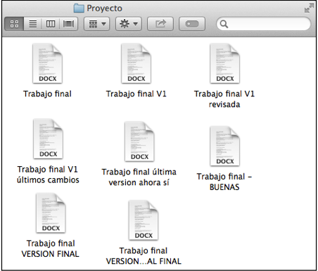

Afortunadamente Word y google Docs tiene un sistema con el cual se puede ver que cambio hubieron recientemente, quien y cuando se hicieron.

Al momento de desarrollar uno se puede encontrar en una situacion similar. y aqui es donde viene a usarse GIT


Git es un sistema de control de versiones que nos permite poder gestionar todas las versiones de nuestro codigo por medio de comandos. Actualmente VSCODE viene con herramientas que hacen mas amigable el uso de git pero se debe de tener en cuenta que hay ocasiones donde se va a requerir el uso de la terminal.

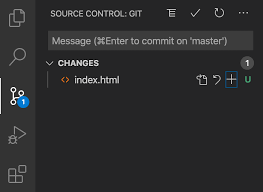

# Instalar git

git no es complicado de instalar para ello se puede seguir la [guia de git](https://git-scm.com/downloads)

puedes confirmar si ya tienes git instalado ejecutando en una terminal `git -v`

# Comandos basicos de GIT

ya con git puedes comenzar a usarlo

## Configurar tu identidad en git

Asi como en word y google docs cuando compartes un archivo y alguien realiza modificaciones estas plataformas no dicen quien y cuando realizo los cambios. En git es similar y para ello necesitas decirle a git a nombre de quien van a estar todos los cambios que realices.

Para ello tienes que ejecutar

```bash
# git config --global user.name [Nombre]
git config --global user.name Edwar
# git config --global user.email [email]
git config --global user.email edwar@gmail.com
```

con esto git ya sabe que los cambios que hagas van a estar vinculados a ese nombre y ese email. al usar `--global` esto se aplicara para todos los repositorios que tengas

## que es un repositorio?

Un repositorio en Git es un lugar donde puedes almacenar tu código y archivos. Es como un armario donde guardas las cosas que estás trabajando.

Cuando creas un repositorio, Git crea un historial de todas las versiones de tu código. Esto significa que puedes volver atrás en el tiempo y ver cómo era tu código en cualquier momento.

Los repositorios también pueden ser compartidos con otros. Esto te permite colaborar con otros desarrolladores en un proyecto.

En términos sencillos, un repositorio en Git es una caja de herramientas que te permite:

- Guardar tu código y archivos de forma segura
- Seguir el historial de cambios de tu código
- Colaborar con otros desarrolladores

## Inicializar el repositiorio

puede iniciar creando tu repositorio con github y luego seguir los pasos que alli te indican o tambien puedes seguir lo siguiente.

Desafortunandamente para este primer paso VS no siempre muestra la opcion segun encontre puede aparecer algo asi:

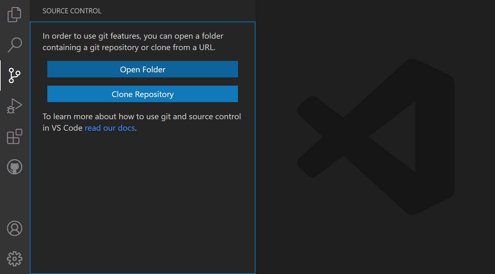 

Dado que no siempre aparecera vamos a abrir la terminal es la ubicacion de nuestro codigo, es decir la carpeta que contiene todo el codigo

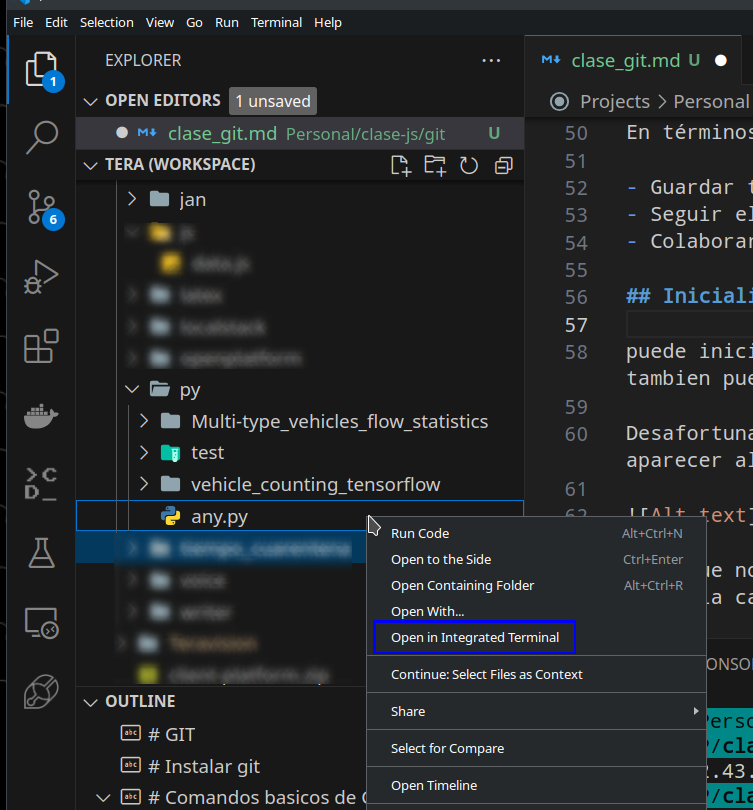

luego en la terminal escribira 

```bash
git init
```

en este momento se ha activado git en tu proyecto y se ha creado esl repositiorio y git comenzara a vizualizar los cambios realizado.

al haber inicializado el repositorio es muy probable que en vscode vea una nueva carpeta que se le ha creado, si no la ve no hay lio generalmente es una carpeta oculta:

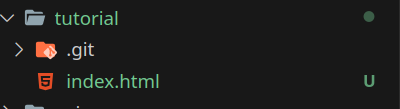

en esa carpete `.git` se cuardan todos los cambios que tenga guardados y si tiene un archivo vera que se archivo aparece en verde indicando que es un cambio nuevo

**NOTA: git no tiene guardado automatico por lo cual no guarda automaticamente los cambios, pero git si revisa automaticamente cuales son los cambios nuevos y estara a la espera de que el usuario le indique que guarde los cambios**

## preparar los cambios para guardarse y guardar cambios

Git te indica que cambio hay si eliminaste, añadiste o modificaste algo. Esto aplica pra indicar si eliminaste o creaste un archivo o lo modificaste. 

En caso de modificar un archivo te indicara si modificaste lineas, si añadiste lineas o eliminaste lineas.

si en vscode nos vamos al icono de la extension de git vamos a encontrar lo siguiente

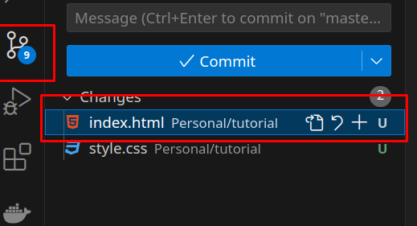

alli aparece los cambios que el ha detectactado.

### preparar los cambios

Para poder guarda los cambios primero tenemos que añadirlos a la lista de cambios que deseas guardar esto dejara esos cambios en algo que git llama `staging area`. para ello usamos el boton de **+** al lado dle nombre del archivo, tambien donde dice changes tambien aparece uno para añadir todos los archivos modificados

si usaras comandos usarias

```bash
# git add [nombre_del_archivo]
git add index.html
```

al añadir un archivo a la lista de lo que deseamos guardar se vera algo asi 

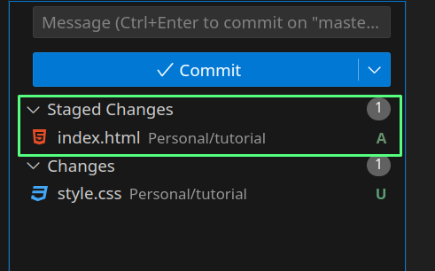

### guardar los cambios

El proceso de guardar cambios en git se conoce como **`commit`** y este commit requiere un mensaje para ello en vscode tenemos un campo para el mensaje el cual debe de ser preferiblemente corto y que indique claramente lo que se realizo en este cambio.

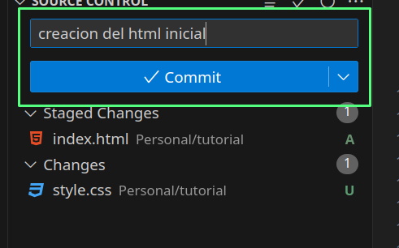

despues se da clic en el boton que dice commit para guardar el cambio con el mensaje

debido al ejemplo que llevamos tendriamos como resultado de este proceso la siguiente pantalla:


asi se haria con comandos

```bash
# git commit -m [mensaje]
git commit -m "mi primer commit"
```

por ultimo guardare mi archivo css con un commit

## Vizualizacion de nuevos cambios

Ya despues de nuestro primer commit en el cual ya tenemos archivos que git ya considera como creados y guardados cuando hagamos un cambio sobre ellos git nos mostrara estos cambios

para el siguiente ejemplo he añadido 5 divs en mi html, tambien borrare el title de mi head y añadire unas lineas vacias al final. en vscode veremos lo siguiente en nuestro archivo html en la seccion lateral donde estan los numeros de la slineas de codigo apareceran algunos colores, rojo indica que algo se elimino, verde añgo añadido y azul algo modificado

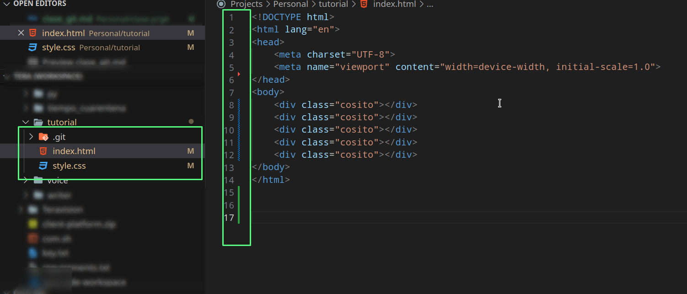

tambien vemos que en la parte lateral nuestros archivos aparecen con una M y en naranja indicando que han sido modificados. style aparece modificado por que le he añadido un pequeño codigo.

Al momento de guardar nuestros cambios podemos visualizar que cambios vamos a guardar. estos con el fin de asegurarnos que nos se nos va a ir nada que no queremos que sea guardado

en esta vista podemos encontrar a la izquierda el archivo antes de las modificaciones y a la derecha el archivo despues de las modificaciones.

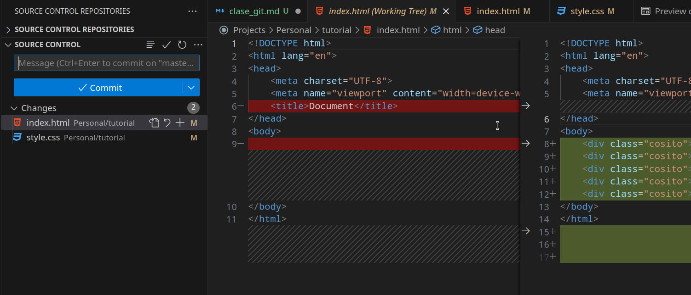

luego de verificar los cambios puedo guardar mis archivo realizando un commit

## comprender el proceso actual

Se que a veces puede ser un poco complicado el entender como funciona esto lo podemos ver como columnas de un kanmban donde sucede lo siguiente

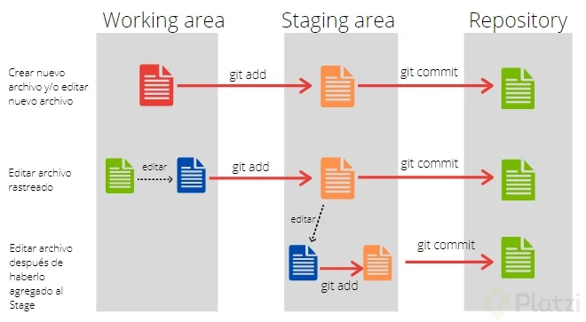

los siguientes videos pueden ser de ayuda

<video width="400" controls>
  <source src="https://www.youtube.com/watch?v=lD5-xYYL5eA" type="video/mp4">
</video>

[](https://youtu.be/lD5-xYYL5eA)

[](https://youtu.be/QutgAelG2Jg)


## ver el historial de commits

En git podemos ver el historial de todos los cambios realizados y para ello con vscode tenemos algunas extensiones antes de ver estas extensiones quiero mostrar la forma de hacerlo con comandos

```bash
# git commit -m [mensaje]
git commit -m "mi primer commit"
```

ahora una de las extensiones es:

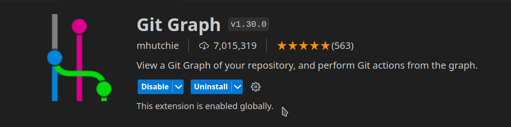

al instalar la extensio podemos ver en nuestra pestaña de git un nuevo boton:

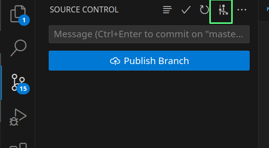

si le damos clic al boton veremos todos los cambios de forma grafica en la cual encontraremos un grafico al inicio como una linea de tiempo, los commit estaran ordenados desde el mas reciente hacia el mas antiguo. luego tenemos la descripcion y alli hay algo que dice master, eso es algo que veremos en la seccion de **ramas** , luego esta la fecha del commit, luego el autor y por ultimo donde dice **"commit"** alli hay un texto alfanumerico , este es un dado conocido como SHA el cual es un identificados unico que hace referencia a cada commit. esto nos servira en secciones posteriores.

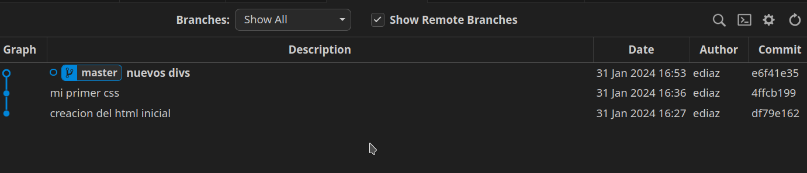