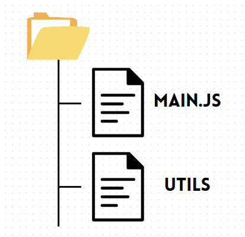
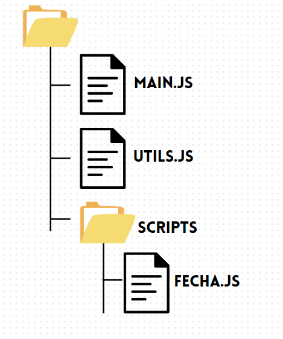
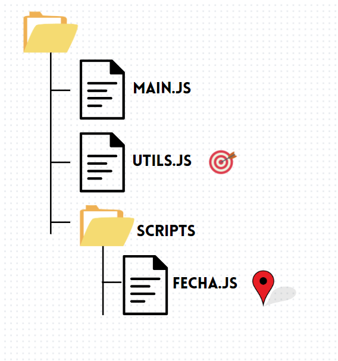
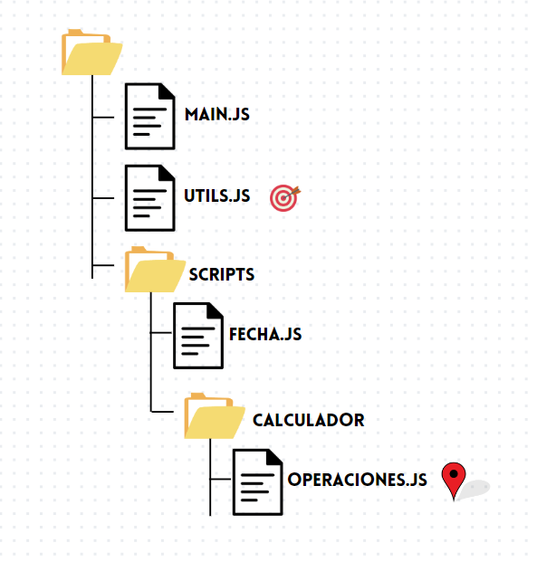
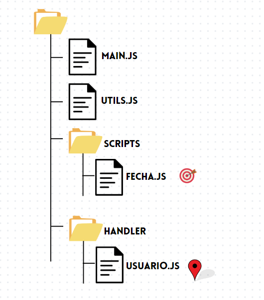

# importar archivos

Ya con la capacidad de añadir archivos a tu html tienes la capacidad de agregar mucha logina de programacion y dinamismo a tus paginas web.


Cuando ya estas haciendo algun proyecto que se comienza a extender, tiene muchas funcionalidades y mucha logica de programacion comenzamos a requerir una forma de ordenarlo. si no tendras un monton incluso miles de linea de codigo y se comenzara a perder el orden


en este momento entra en gran importancia el poder seccionar tu codigo en diferentes archivos y aun asi poder llamarlo desde uno o varios archivos. esto te permitira mayor orden en tu proyecto y poder seccionar tu codigo por seccione o areas

hay varias formas de exportar codigo y de importarlo pero actualmente hay un estandar dado por ECMAscript por lo cual descartaremos el `requite` como forma de importar.

## Exportar

para importar primero necesitamos exportar por lo cual supongamos que tenemos una funcion que nos da la fecha de hoy y para exportar esa funcion debemos usar la palabra clave  `export` antes de la funcion

por lo cual la forma de exportar la funcion seria 
```javascript
export function fechaHoy() {
    return new Date().toLocaleString()
}
```
de esta forma ya no requerimos el module.export pero si lo quisieramos usar seria:
```javascript
module.exports = {
  fechaHoy() {
    return new Date().toLocaleString();
  },
};

// o 

function fechaHoy() {
    return new Date().toLocaleString()
}

module.exports = {
    fechaHoy
};
```

usaremos debido a las actualizaciones de ECMAscript ya no se requiere usar `module.export`

### exportar multiples elementos

ahora puede que tenga varias funciones o constantes en un archivo que quiera exportar. esto lo puede hacer de varias formas.

y si no se coloca el export esa funcion no sera exportada y si crea una contante tambien puede exportarla

```javascript

export const googleURL = "google.com"; 
 
export function suma(a,b) {
    return a+b
}

export function resta(a,b) {
    return a-b
}

function multiplicacion(a,b) {
    return a*b
}
```

tambien puede exportar como una lista de exports al final de su archivo

```javascript

const googleURL = "google.com"; 
 
function suma(a,b) {
    return a+b
}

function resta(a,b) {
    return a-b
}

multiplicacion(a,b) {
    return a*b
}

export {
    googleURL,
    suma,
    resta
}
```

## importar

ya sabiendo exportar es hora de importar nuestro codigo para ello al inicio del archivo de javascript usaremos la siguiente estructura


```javascript
import { nombre_de_lo_que_importo } from "ruta"
```
pero antes de ello es posible que te mande error dado que puede decir algo como **"no se puede usar import fuera de un modulo"**. para resolverlo debemos hacer un pequño ajuste de nuestro javascript en nuestro html

```html
<script type="module" src="test.js"></script>
```

suponiendo que tengo 2 archivos al mismo nivel es decir que los 2 estan en la misma carpeta
el archivo que exports se llama `utils.js` y elque importa se llama `main.js` por lo cual en main escribimos lo siguiente:




```javascript
import { getFullName } from "./utils.js";
```
si esta usando algun framework como `react` no requiere escribir el `.js` react lo infiere automaticamente

### cambiar el nombre a un import

hay ocaciones donde se puede requerir renombrar un import pero sin cambiar el nombre de la funcion original para ello podemos usar

```javascript
import { getFullName as obtenerNombre } from "./utils.js";
```


### importar un archivo que esta dentro de una carpeta

si deseamos organizar nuestro proyecto por carpetas esto nos viene genial por lo cual en la ruta debemos de tener en cuenta el folder. en el siguiente ejemplo haremos un import desde `main.js` hacia el archivo `fecha.js`

por lo cual usaremos
```javascript
import { fechaHoy } from "./scripts/fecha.js";
```

ahora puede que sea el caso inverso y estes dentro de una carpeta y quieras importar algo que este fuera de la carpeta y para ello en lugar de usar `./` usaras `../` y eso te servira para salir de tu carpeta en los imports pongamos lo siguentes casos



```javascript
import { getFullName } from "../utils.js";
```


```javascript
import { getFullName } from "../../utils.js";
```

```javascript
import { fechaHoy } from "../scripts/fecha.js";
```

acontinuacion encontraras un [ejemplo practico](./archivos/) 