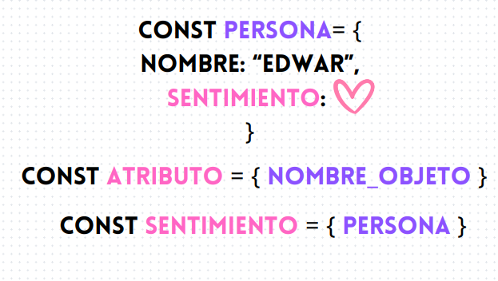

# JSON Y OBJETOS

**Contenido**

- [que es](#que-es-json-y-que-son-objetos)
- [crear un objeto](#crear-un-objeto)
- [propiedades](#propiedades-llaves-de-los-objetos-y-json)
- [diferencia entre objeto y json](#diferencia-entre-objeto-y-json)
- [objetos anidados](#objetos-anidados)
- [las propiedades mantienen sus metodos](#)
- [arrays dentro de los objetos y array de objetos](#arrays-dentro-de-los-objetos-y-array-de-objetos)
- [visualizacion de json comoda](#visualizacion-de-json-comoda)
- [Metodos de JSON](#metodos-de-json)
- [objetos pasados como parámetros y retornados](#objetos-pasados-como-parámetros-y-retornados)
- [Clonacion de objetos y destructuring](#clonacion-de-objetos-y-destructuring)
- [](#)

## que es json y que son objetos

JSON siendo las siglas de Javascript object notacion es una forma en la cual se puede escribir un conjunto de datos de javascript lo cuales puedes ser usados por el mismo frontend , usados para comunicarse con el back con el fin de realizar la comunicacion de informacion compleja de forma organizada. Adicionalmente esta notacion esta hecha para que sea de facil lectura para el humano

ahora al buscar json u objeto en las documentaciones se puede encontrar que se ven muy similares. entonces cual es la diferencia. que JSON es una formato. y como formato debe de seguir ciertas reglas pero los objetos tambien se pueden ver u escribir con formato JSON. se que esto puede sonar confuso pero me remitire a ejemplos.

primero veamos que es un objeto: un objeto es una colección de pares clave-valor. La clave es siempre una cadena y debe ser única en la colección. El valor puede ser una primitiva, un objeto o incluso una función. la clave en algunos casos tambien llamada `llave` o `key` es por asi decirlo el nombre de una `"variablw"` donde guardaremos algo.

siempre puede reconocer si algo es un objeto o json por que va a encontrar que esa variable inicia y finaliza con `{}`

## crear un objeto

para crear un objeto hay unas cuantas formas mostrare 3 pero la mas usada es la primera:

```javascript
// 1
const car = {};
// 2
const car = new Object();
// 3
const car = Object.create({});
```

## propiedades (llaves) de los objetos y JSON

las propiedades en los objetos y los JSON son la informacion que pueden guardar la diferencia entre ambos es que un objeto puede tener funciones dentro de sus propiedades y el JSON no

### acceder a propiedades

```javascript
const car = {
  marca: "BMW",
};
```

en este ejemplo el objeto es `car` y tiene una propiedad o llave llamada `marca` con esta propiedad o llave yo puedo acceder al valor que contiene y para acceder a una propiedad yo puedo usar

```javascript
// nombreObjeto.propiedad
console.log(car.marca); // BMW
```

tambien yo puedo acceder a las propiedades usando `['nombre de la propiedad']` esta forma se usa como alternativa de acceder a una propiedad dado que me permite con un string acceder a la propiedad estome permite incluso dinamismo.

```javascript
// nombreObjeto['propiedad']
console.log(car["marca"]); // BMW
```

### Crear propiedades

puede inicialmente crear un objeto vacio como ya vimos anteriormente y puedes crearlo con las propiedades que quieras. entre estas propiedades puedes crear propiedades de tipo:

- string
- number
- boolean
- Array
- Object
- null
- function **(solo disponible para objetos mas no para JSON)**
- Dates **(solo disponible para objetos mas no para JSON)** **se puede en json si se convioerte a string**

siempre cada propiedad debe estar separada por una coma `,`

un ejemplo de un objeto con varios de estos tipo podria ser:

```javascript
const persona = {
  nombre: "Edwar Diaz", // tambien funciona con ' ' y  ``
  edad: 27,
  saldo: 1000000,
  cansado: false,
  idiomas: ["ingles", "español", "frances"],
};
```

ta teniendo un objeto creado podemos crearle mas propiedades en el transcurso de la ejecucion de nuestro codigo y para hacerlo como si asignaramos una variables

```javascript
const persona = {
  nombre: "Edwar Diaz", // tambien funciona con ' ' y  ``
  edad: 27,
  saldo: 1000000,
  cansado: false,
  idiomas: ["ingles", "español", "frances"],
};

// creando una nueva propiedad llamada "nacionalidad"
persona.nacionalidad = "Colombia";
// si yo impromo el resultado de esto justo despues de esta linea obtendre
console.log(persona); // {
//   nombre: "Edwar Diaz",
//   edad: 27,
//   saldo: 1000000,
//   cansado: false,
//   idiomas: ["ingles", "español", "frances"],
// }

// incluso puedo acceder a la propiedad persona ya que ha sido creada
console.log(persona.nacionalidad);
// tambien funcionaria si uso:
persona["nacionalidad"] = "Colombia";
```

tiene que tener en cuenta que si intenta acceder a la variable antes de crearla recibira un undefined

```javascript
const persona = {
  nombre: "Edwar Diaz", // tambien funciona con ' ' y  ``
  edad: 27,
  saldo: 1000000,
  cansado: false,
  idiomas: ["ingles", "español", "frances"],
};

// incluso puedo acceder a la propiedad persona ya que ha sido creada
console.log(persona.nacionalidad); // undefined

// creando una nueva propiedad llamada "nacionalidad"
persona.nacionalidad = "Colombia";
```

ahora puede que necesites crear propuedades de mas de una palabra como por ejemplo `fecha de nacimiento` si quiero crear una propiedad con ese nombre puedo usar

```javascript
persona.fechaNacimiento = "17/07/1996";
persona.fecha_nacimiento = "17/07/1996";
persona["fecha nacimiento"] = "17/07/1996";
const persona = {
  nombre: "Edwar Diaz"
  "fecha nacimiento": "17/07/1996"
};

// si tiene espacios como los ultimos ejemplos solo puedo acceder usando
console.log(persona["fecha nacimiento"])

```

### editar propiedades de los JSON y Objetos

similar a como se editar o se le asigna un nuevo valor a una variables en JS tambien lo podemos hacer con los objetos

```javascript
const persona = {
  nombre: "Edwar Diaz", // tambien funciona con ' ' y  ``
  edad: 27,
  saldo: 1000000,
  cansado: false,
  idiomas: ["ingles", "español", "frances"],
};

persona.nombre = "Edwar Diaz Ruiz";
```

### eliminar propiedades

en caso que necesite purgar un json de variables que no necesito procesas o enviar hacia el back puedo eliminarlas:

```javascript
const persona = {
  nombre: "Edwar Diaz", // tambien funciona con ' ' y  ``
  edad: 27,
  saldo: 1000000,
  cansado: false,
  idiomas: ["ingles", "español", "frances"],
};

delete persona.saldo;
// justo despues de esa linea ya se ha borrado la propiedad
```

## diferencia entre objeto y JSON

JSON es un formato por lo cual tambien se puede crear archivos con terminacion `.json` en estos archivos se puede guardar informacion para la aplicacion. pero cual es la diferencia en javascript? que en javascript un json convencionalmente seguiria la estructura de un json

[estructura](https://www.json.org/json-en.html)

es decir que en un ejemplo de diferencia seria

```javascript
/// objeto
const persona = {
  nombre: "Edwar Diaz",
  edad: 27,
  saldo: 1000000,
  cansado: false,
  idiomas: ["ingles", "español", "frances"],
};

/// json
const persona = {
  nombre: "Edwar Diaz",
  edad: 27,
  saldo: 1000000,
  cansado: false,
  idiomas: ["ingles", "español", "frances"],
};
```

## objetos anidados

como se menciono antes se pueden tener objetos dentro esto permite poder alamenar mas informacion y organizarla por ejemplo:

```javascript
/// objeto
const persona = {
  nombre: "Edwar Diaz",
  edad: 27,
  saldo: 1000000,
  cansado: false,
  idiomas: ["ingles", "español", "frances"],
  veiculo: {
    marca: "BMW",
    color: "plateado",
    kilometraje: 1567,
    averiado: false,
    tecnomecanica: {
      expedicion: "10/10/2023",
      expiracion: "10/10/2024",
    },
  },
};
```

si yo quiero acceder a las propiedades usaria `.` o `[]` hasta llevar a la propiedad deseada por ejemplo

```javascript
console.log(persona.veiculo) // aqui obtendia un objeto o json con lo que esta en "veiculo"
console.log(persona.veiculo.marca) // BMW
console.log(persona.veiculo['marca']) // BMW
console.log(persona.veiculo.tecnomecanica.expedicion) // 10/10/2023
console.log(persona.veiculo.tecnomecanica.['expedicion']) // 10/10/2023
console.log(persona.veiculo['tecnomecanica']['expedicion']) // 10/10/2023

// asi mismo puedo cambiar el valor

persona.veiculo.tecnomecanica.expedicion = "01/01/2024"

```

# las propiedades mantienen sus metodos

las propiedades de un json tienen sus metodos normales de JS y esto que quiere decir. que si una propuedad es de tipo string puede tener todos los metodos de in string asi mismo si es tipo Date o array. por ejemplo

```javascript
const persona = {
  nombre: "Edwar Diaz",
  edad: 27,
  saldo: 1000000,
  cansado: false,
  idiomas: ["ingles", "español", "frances"],
  veiculo: {
    marca: "BMW",
    color: "plateado",
    kilometraje: 1567,
    averiado: false,
    tecnomecanica: {
      expedicion: "10/10/2023",
      expiracion: "10/10/2024",
    },
  },
};

console.log(persona.nombre, split(" ")); // ["Edwar", "Diaz"] ... esto no afecta a la propiedad
console.log(persona.idiomas.find((item) => item === "ingles")); // ingles
```

# arrays dentro de los objetos y array de objetos

Los objetos en JS pueden tener arrays como ya hemos visto anteriormente y los arrays pueden tener dentro de ellos elementos de cualquier tipo por lo cual es posible que un objeto tenga un array con objetos dentro lo que lo convertiria en una lista de objetos como en el siguiente ejemplo

```javascript
const persona = {
  nombre: "Edwar Diaz",
  edad: 27,
  saldo: 1000000,
  cansado: false,
  idiomas: [
    {
      nombre: "ingles",
      nivel: "b1",
    },
    {
      nombre: "español",
      nivel: "nativo",
    },
    {
      nombre: "frances",
      nivel: "a1",
    },
  ],
  veiculo: {
    marca: "BMW",
    color: "plateado",
    kilometraje: 1567,
    averiado: false,
    tecnomecanica: {
      expedicion: "10/10/2023",
      expiracion: "10/10/2024",
    },
  },
};
```

de esta forma podemos tener un listado de objetos.

tambien podemos tener el siguiente ejemplo donde sea un listado de objetos que tengan sus respectivas propuedades

```javascript
const personas = [
  {
    nombre: "Edwar Diaz",
    edad: 27,
    saldo: 1000000,
    cansado: false,
    idiomas: ["ingles", "español", "frances"],
  },
  {
    nombre: "Estefania Salcedo",
    edad: 24,
    saldo: 1000000,
    cansado: false,
    idiomas: ["ingles", "español", "frances", "portugues", "koreano"],
  },
  {
    nombre: "Tony Stark",
    edad: 38,
    saldo: 10000000000,
    cansado: false,
    idiomas: ["ingles"],
  },
];
```

un listado de objetos es algo muy comun cuando obtenemos respuesta de un backend cuando vamosd a puntar una tabla o algun listado de informacion como por ejemplo para un selector (dropdown) o por ejemplo un listado de blogs o post. esto nos llega en forma de array desde el back y un array de objetos. Con react se facilita el renderizar elementos en html que se repiten y estan basados en una lista de objetos.

El tener una lista de objetos me permite aplicar los metodos de los array para obtener algun resultado que queramos por ejemplo

```javascript
const personas = [
  {
    nombre: "Edwar Diaz",
    edad: 27,
    saldo: 1000000,
    cansado: false,
    idiomas: ["ingles", "español", "frances"],
  },
  {
    nombre: "Estefania Salcedo",
    edad: 24,
    saldo: 1000000,
    cansado: false,
    idiomas: ["ingles", "español", "frances", "portugues", "koreano"],
  },
  {
    nombre: "Tony Stark",
    edad: 38,
    saldo: 10000000000,
    cansado: true,
    idiomas: ["ingles"],
  },
];

// filtrar a las personas menores a 30 años

const menores30 = personas.filter((persona) => oersona.edad <= 30);

// usando un map podemos obtener una lista personalizada basada en la informacion de otra lista
// como por ejemplo saber en un objeto cuantos idiomas en total sabe una persona.

const personasIdiomas = personas.map((persona) => {
  return {
    nombre: persona.nombre,
    cantidadIdiomas: persona.idiomas.length,
  };
});
```

asi como los ejemplos anteriores podemos usar metodos de los array para manupular nuestra lista de objetos a conveniencia. **Recomendacion es siempre mirar si se puede utilizar un metodo de los array antes de usar algo como un `for`**

# visualizacion de json comoda

en ocasiones un JSON puede ser muy largo y tener muchos niveles de anidamiento, en esos casos tener algo visial ayuda muchisimo:

https://jsoncrack.com/editor

# metodos de json

ya que un objeto tiene una estructura compatible con JSON este puede tener ciertos metodos que no van aplicados obre el objeto pero que se tiene que usar un Objeto llamado `JSON` para poder usar los metodos

## convertir un JSON a string

```javascript
const persona = {
  nombre: "Edwar Diaz",
  edad: 27,
  saldo: 1000000,
  cansado: false,
  idiomas: ["ingles", "español", "frances"],
  veiculo: {
    marca: "BMW",
    color: "plateado",
    kilometraje: 1567,
    averiado: false,
    tecnomecanica: {
      expedicion: "10/10/2023",
      expiracion: "10/10/2024",
    },
  },
};

const myJsonString = JSON.stringify(persona);
console.log(myJsonString); // '{"nombre":"Edwar Diaz","edad":27,"saldo":1000000,"cansado":false,"idiomas":["ingles","español","frances"],"veiculo":{"marca":"BMW","color":"plateado","kilometraje":1567,"averiado":false,"tecnomecanica":{"expedicion":"10/10/2023","expiracion":"10/10/2024"}}}'
```

## convertir string a JSON

tambien podemos hacer el proceso inversion al punto anterior en caso que en alguna respuesta de algun servidor obtengamos un JSON en forma de string

```javascript
const personaString =
  '{"nombre":"Edwar Diaz","edad":27,"saldo":1000000,"cansado":false,"idiomas":["ingles","español","frances"],"veiculo":{"marca":"BMW","color":"plateado","kilometraje":1567,"averiado":false,"tecnomecanica":{"expedicion":"10/10/2023","expiracion":"10/10/2024"}}}';

const persona = JSON.parse(personaString);
```

# objetos pasados como parámetros y retornados

cuando necesitas recibir varios parametros en una funsion y generalmente si es mas de 4 se recomienda recibir en lugar de diferentes parametros es mejor recibir un objeto como parametro de la funcion.

```javascript
const persona1 = {
  nombre: "Edwar Diaz",
  edad: 27,
  ingresos: 1000000,
  egresos: 5000,
  cansado: false,
  idiomas: ["ingles", "español", "frances"],
};

function saldo(persona) {
  return `El usuario ${persona.nombre} tiene un saldo de : ${
    persona.ingresos - persona.egresos
  } y sabe ${persona.idiomas.length} idiomas`;
}

console.log(saldo(persona1)); // `El usuario Edwar Diaz tiene un saldo de : 995000 y sabe 3 idiomas`
```

Asi mismo se puede recibir un array de objetos en caso de ser necesario

si se requiere retornar de una funcion mas de un valor se recomienda ternar un objeto

```javascript
const persona1 = {
  nombre: "Edwar Diaz",
  edad: 27,
  ingresos: 1000000,
  egresos: 5000,
  cansado: false,
  idiomas: ["ingles", "español", "frances"],
};

function saldoIdiomas(persona) {
  return {
    saldo: persona.ingresos - persona.egresos,
    cantidadIdiomas: persona.idiomas.length,
  };
}

console.log(saldo(persona1)); // {saldo: 995000, cantidadIdiomas: 3 }
```

# Clonacion de objetos y destructuring

similar como los arrays si se hace lo siguiente:

```javascript
const car = {
  color: "blue",
};

const anotherCar = car;
anotherCar.color = "yellow";
car.color; //'yellow'
```

Esto sucede dado que por debajo JS tiene el objeto como una referencia en memoria

para solventar esto se usan `...` de destructuring para pasar todos los atributos de un objeto a otro

```javascript
const persona1 = {
  nombre: "Edwar Diaz",
  edad: 27,
  ingresos: 1000000,
  egresos: 5000,
  cansado: false,
  idiomas: ["ingles", "español", "frances"],
};

const persona2 = { ...persona1 };
```

## destructurin de atributos

en ocaciones si recibimos un objeto en una funcion puede facilitarse para nuestro uso el objetener un atributo del objeto y convertirlo en variable y podemos hacer esto 

```javascript
const persona1 = {
  nombre: "Edwar Diaz",
  edad: 27,
  ingresos: 1000000,
  egresos: 5000,
  cansado: false,
  idiomas: ["ingles", "español", "frances"],
};

function saldo(persona) {
  // declarar la variable
  const nombre = persona.nombre;
  return `El usuario ${nombre} tiene un saldo de : ${
    persona.ingresos - persona.egresos
  } y sabe ${persona.idiomas.length} idiomas`;
}
```

algo mas recomendado que es un codigo mas limpio y que vscode le puede ayudar a detectar que atributos puede extraer es usando destrcuturing



```javascript
const persona1 = {
  nombre: "Edwar Diaz",
  edad: 27,
  ingresos: 1000000,
  egresos: 5000,
  cansado: false,
  idiomas: ["ingles", "español", "frances"],
};

function saldo(persona) {
  // destructuring { atributo } = objeto
  const { nombre } = persona;
  return `El usuario ${nombre} tiene un saldo de : ${
    persona.ingresos - persona.egresos
  } y sabe ${persona.idiomas.length} idiomas`;
}
```